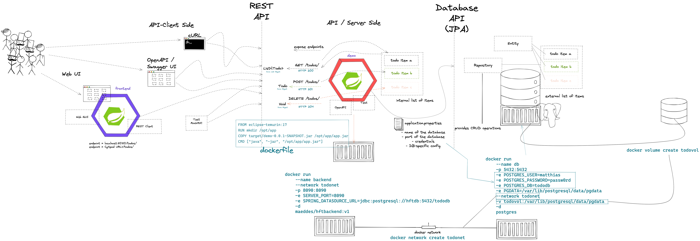

# Middleware / Modern Software Architecture - Winter Semester 2022 - HfT

## Session 07-Oct-2022 Distributed Systems & Cloud Computing Introduction

### Intro questions:

* Which technologies or what do you have in mind in general if you think about "middleware" or "modern software architecture"?
* the "WHY" - Why would people use and implement a "modern middleware" architecture?


### Content

* Why distributed systems?
* What is Cloud Computing? Encounters in everyday life and history
* Characteristic, advantages & challenges
* Terminology - public, private, hybrid, dedicated
* Abstraction layers - IaaS, PaaS, FaaS, SaaS
* Overview - Hypervisors, virtual machines, containers and orchestration

### Objectives and exercises
_The student is able to describe the reasons for distributed systems and
cloud computing in own words and list examples for offerings, topologies and technologies. Includes ability to differentiate between different abstraction layers and knowledge how those layers and according technologies interact with each other. No exercises in this module_

### Links:

* https://landscape.cncf.io/
* https://csrc.nist.gov/publications/detail/sp/800-145/final
* https://spring.io/tools

### Tools:

* https://www.jetbrains.com/idea/
* https://code.visualstudio.com/docs/java/java-tutorial
* https://marketplace.visualstudio.com/items?itemName=Pivotal.vscode-boot-dev-pack
* https://www.gitpod.io

### Lookout on Lab activities


## Session 14-Oct-2022 Docker Exercises (unattended lecture)


* https://hfthse.trainings.nvtc.io/

## Session 21-Oct-2022 Container Technology


-   What are containers and how do they work
-   Containers vs. VMs
-   History of containers and rise of Docker
-   Docker concepts: daemon, hub, dockerfile, CLI
-   Running containers with various options


### Objectives and exercises

_The student understands the concepts and use cases of container technology and is able to describe them. The first exercise is to pull sample images from an image registry (e.g. Docker Hub) and interact with them (run, expose port, execute shell, cleanup etc). After that the student can show how to build a custom image via Dockerfile and push it to a registry for others to access. Complete the exercises handed out via URL._

### Links

-   [https://labs.play-with-docker.com/](https://labs.play-with-docker.com/)
-   [https://opencontainers.org/](https://opencontainers.org/) 
-   [https://www.docker.com/products/docker-desktop](https://www.docker.com/products/docker-desktop)  
-   [https://www.youtube.com/watch?v=fqMOX6JJhGo](https://www.youtube.com/watch?v=fqMOX6JJhGo)

### Review questions

* "WHY" Containers? List advantages/disadvantages ..
* What is the difference between a container and a VM? List 3 criteria
* Which technologies led to the evolution of docker (and why)? 
* What is the difference between a docker daemon and the docker hub? 
* What is the difference between docker run, docker pull and docker start?
* Which command transitions from a container instance to an image?
* What are the Docker components and describe them?
* What does docker exec do? Provide a pseudo-code example and explain what it does 

## Session 28-Oct-2022 Introduction to Spring Boot

* Background: Spring Framework - History & components
* Spring ← → Spring Boot
* Spring Initializr (start.spring.io) & starter dependencies
* Basic project structure (folders, configuration ..)
* "Hello, World!" example explained
* Using Actuator


### Objectives

The student is able to build and configure an own Spring Boot application from scratch with the IDE of choice. The exercise is to build an own "Hello, World!" application that exposes various - endpoints and is able to execute CRUD operations on the state of the application. Optional: Add logging and testing, configure Actuator.

### Exercises

Basic setup:

- Set up an own gitlab or github repository
- Either set up an own local Java IDE or use gitpod.io

Helpful Links:

- https://github.com/
- https://gitlab.com/
- https://gitpod.io/
- https://www.gitpod.io/docs/introduction/languages/java

Application:

- Build your own first Spring Boot Hello, World application at 
- https://start.spring.io
- Change name, Java version, build tool, dependencies. Observe changes
- Use the following deps: Web, Actuator, DevTools
- Annotate a class with @RestController and expose "some" Rest Mappings
- Experiment with other Mappings, e.g. @GetMapping, @PostMapping
- Pass a parameter via @PathVariable

Helpful Links:

- https://start.spring.io
- https://www.baeldung.com/spring-requestmapping
- https://spring.io/guides#getting-started-guides
- Full tutorial (stuff for next weeks): https://www.baeldung.com/spring-boot-start

## Session 04-Nov-2022 

* Synchronous communication
* HTTP and REST
* Verbs, Resources, Nouns
* Evolution, Richardson Maturity Model
* CRUD Operations
* Building a REST API with Spring (Boot)
* Building a data model with REST


### Objectives and exercises
_The student understands the concepts of an API and synchronous communication in distributed systems and can explain it in own words._


### Exercise/Lab Task

* Create a full CRUD Rest API on your application
* The API object is a simple Java object with the following field
````
    private String todo;
    private int priority = 2;
````
* A RestController class is supposed to have an internal list of these objects and provide CRUD functionality.
* Starter sample is given in the git repo.

Links:

* https://restfulapi.net/idempotent-rest-apis/
* https://restfulapi.net/richardson-maturity-model/
* https://en.wikipedia.org/wiki/List_of_HTTP_status_codes

* https://www.baeldung.com/spring-requestmapping
* https://www.baeldung.com/spring-request-response-body
* https://www.baeldung.com/spring-rest-openapi-documentation
* https://www.baeldung.com/spring-cors

### Review questions

* Identify good and bad API examples and explain why
* Describe the concepts of Verbs and Nouns
* When is an invocation idempotent and safe? What does it mean? Provide examples
* Describe in your own words the mapping of REST calls to database (SQL) and CRUD calls

## Session 11-Nov-2022 Frontend <- REST -> Backend Options: OpenAPI, Swagger, Thymeleaf, WebClient

* Use OpenAPI and Swagger as built-in documenation for the REST API
* Use WebClient as REST client within an application
* Build a graphical web UI using Thymeleaf
* CRUD operations between applications
* Connect Thymeleaf and WebClient functionality

### Objectives and exercises
_The student is able to understand web UIs using Thymeleaf technologie. The student understands the WebClient as default REST Client for Spring Boot applications and is able to implement CRUD operations with a REST API. In the exercise combine both technologies to provide a graphical web UI to interact with a REST API of another service._


## Session 18-Nov-2022 Persistence & Spring Data JPA

* Spring Data
* Concept of entities and repositories
* JPA and JDBC basics
* H2, PostgeSQL, MySQL - configuration via Spring Boot profiles
* Running databases as Docker images


### Objectives and exercises
_The student is able to build a Spring Boot application (or extend an existing one) with Spring Data configuration. The exercise is to create an application, which performs CRUD operations on a database backend. The database can either be in-memory (H2) or a (containerized) PostgreSQL. Optional: Provide a docker-compose file to stand up a multi-container environment with application and database._

### Review Questions

* "WHY" persistence? "WHY" persistence frameworks like JPA?
* Describe the necessary components to build an application with Spring Data? Potentially sketch
* What does the annotation @Entity do? 
* How could docker compose help if you have a persistence-based application?

## Session 09-Dec-2022 Advanced Container - docker-compose & network




## Session 16-Dec-2022 Advanced Container - volumes & docker-compose , container build options


* Difference and relation between container and container images
* Concepts of image layers
* "docker commit"
* History of Dockerfile. Initial, multi-stage & BuildKit
* Building container for Java apps
* Using Jib, Cloud-Native Buildpacks and Paketo


### Objectives and exercises
_The student understands the relation between container image and container, how to instantiate a container from an image and how to commit to a new image from an existing container. The exercise is to build the previous Spring Boot application and put it into a container image using various options, e.g. different Dockerfile options, Google JIB, CND, Paketo and more ...? The student is aware and able to describe on a high-level what the different fundamentals of the various approaches are and is able to list advantages and disadvantages._

### Links

* https://docs.docker.com/engine/reference/builder/
* https://buildpacks.io/
* https://paketo.io/
* https://github.com/maeddes/options-galore-container-build/blob/main/walkthrough.adoc
* https://github.com/GoogleContainerTools/jib

=== Review questions

* List 3 different options to build a container image
* Explain docker build vs docker commit 
* List 2 evolution steps of the Dockerfile and provide 1 improvement for each step 
* Explain or list 1 advantage&disadvantage comparing JIB and Paketo/CNB to original Dockerfiles
* How is a container image build up internally?
* Which are criterias you can think that make image building "better" 

## Session 23-Dec-2022 Microservices (Theory)

* CAP Theorem
* Conway's Law
* Fallacies of distributed computing
* Domain-Driven Design basics
* 12-factor application
* Evolution of applications and deployments: Monolithic -> Service-Oriented Architecture -> Microservices
* Introduction to serverless and FaaS terminology

### Objectives and exercises
_The student knows about the evolution of distributed systems (and middleware) and the drivers towards state-of-the-art implementation and deployment. She/he can explain the underlying concepts and theories and put it into practical context. No dedicated exercises for this module. Recap of basics: Spring Boot, Docker, configuration, persistence and messaging._

### Review questions

* "WHY" Cloud-Native Software? What IS Cloud-Native Software?
* Why "evolution" from a monolithic approach to a distributed approach?
* How does the CAP Theorem/Conway's Law relate to this?
* (NO Domain-Driven Design questions)
* How do the 12-factor application "methodology" relate to the technologies that we covered in this semester? (important)
* "WHY" is external configuration important in cloud-native software?
* Where did you see aspects of external configuration in the technologies we used? Provide examples

## Session 13-Jan-2023 / 20-Jan-2023 Module: Kubernetes Intro

* Presentation: Cloud Platforms & Kubernetes
* Kubernetes Background
* What is CaaS?
* Cluster & Node Concept
* Behaviour scenarios of Kubernetes in Action
* Base API objects: Deployments, ReplicaSets, Pods, Services
* Intro into kubectl 
  
### Objectives and exercises
_The student understands the requirements and expectations towards cloud platforms and is able to list them. She/he can explain the advantages over standard container operation with Docker. The exercise is to take a sample Spring Boot application and walk through the steps to containerize and deploy to Kubernetes. The student is aware about various options for local and remote Kubernetes options._

image:images/kubernetes_overview.png[Kubernetes in a nutshell]

### Review questions

* Please write 100 lines of YAML Code :)
* Explain the relation of "some" of the 12 factors in relation to Kubernetes
* Explain the core principe of Kubernetes in own words. "Why" Kubernetes?
* What is pod? What is a service? What is a deployment?
* Which kind of Kubernetes providers do you know? Can they be grouped somehow?

### Links

* https://docs.docker.com/engine/reference/commandline/compose_build/
* https://kubernetes.io/docs/tasks/configure-pod-container/configure-liveness-readiness-startup-probes/
* https://www.baeldung.com/spring-value-annotation

### Links - Kubernetes Options

* https://github.com/learnk8s/free-kubernetes (Overview)

* https://www.katacoda.com/courses/kubernetes/playground (web-based)
* https://training.play-with-kubernetes.com/ (web-based, broken?)

* https://kind.sigs.k8s.io/docs/user/quick-start/ (local)
* https://minikube.sigs.k8s.io/docs/ (local)
* https://docs.docker.com/get-started/kube-deploy/ (local)